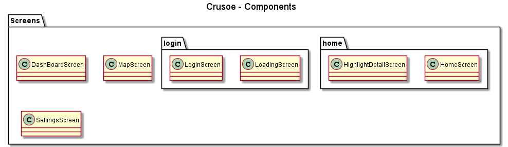
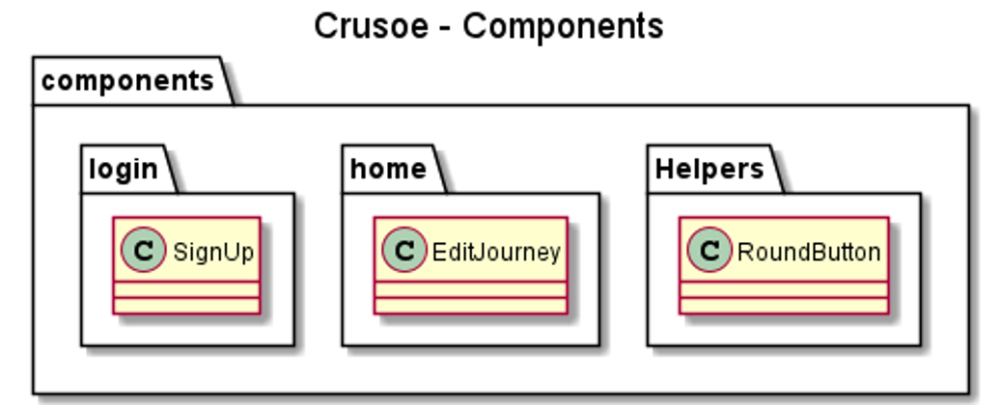
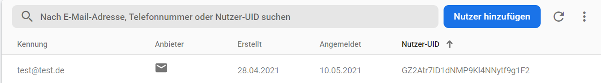
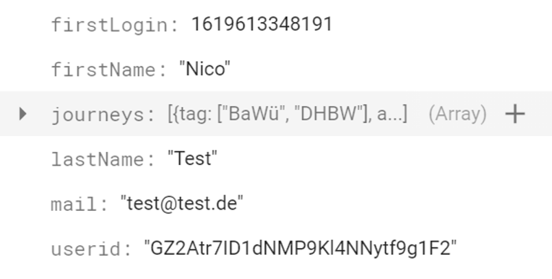
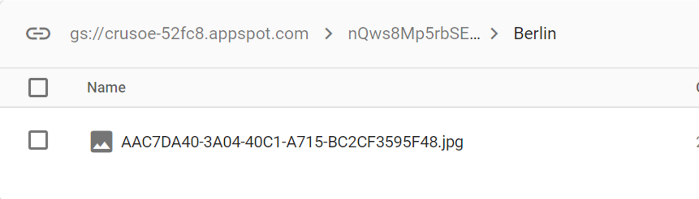

# Crusoe
Examination Task for the lecture "Entwicklung mobiler Applikationen" at the DHBW 

## Documentation

- [Frontend](#frontend)
- [Backend](#backend)
- [Nutzerverwaltung](#nutzerverwaltung)
- [Datenpersistierung](#datenpersistierung)
- [Bildpersistierung](#bildpersistierung)

### Frontend

Für diese Version von „Crusoe“ wurde das Framework „React Native“ herangezogen. Das Frontend besteht aus Komponenten, welche auch verschachtelt sein können. Dies wird nachstehend näher erläutert.

Wie in der obenstehenden Abbildung zu erkennen ist, gibt es für jede Ansicht der App eine React Komponente. Programmatisch ist diese als Klasse definiert. Dabei sind die Screens in Unterordner gemäß ihrem Anwendungsfall gegliedert. Dies ist beispielsweise „login“. Zwischen diesen Komponenten findet die Navigation in der Applikation statt. Weitere React-Komponenten, welche in den Screens gerendert werden, sind nachstehend aufgeführt.

In der Abbildung oben sind beispielhaft einige Komponenten aufgeführt, welche in den Screens gerendert werden. Die Verzeichnisstruktur ist auch hier gemäß den Anwendungsfällen (login, home, etc.) aufgebaut. Im Unterverzeichnis „Helpers“ befinden sich Komponenten, welche Global in der App zu finden sind. „RoundButton“ kapselt einen runden Button, welcher gemäß dem Styling in der App verwendet wird. Weitere Komponenten sind die Felder für das Anmelden/Registrieren. Diese sind in der Komponente „SignUp“ zu finden. Oder „EditJourney“ für das Bearbeiten von Reisen. Die Komponenten aus Abbildung 2 sind nur ein exemplarischer Auszug. Alle weiteren Komponenten können im Repository eingesehen werden.

### Backend

Für das Backend wurde Firebase von Google genutzt. Mit Firebase werden Zugangsdaten der Nutzer, Reisen und die Bilder der Reisen verwaltet. Diese Funktionen werden nachstehend erläutert.

### Nutzerverwaltung

Firebase bietet eine Datenbank an, welche Nutzer verwaltet. Dazu können in Firebase Authentifizierungsmethoden angegeben werden. In „Crusoe“ kann man sich mit Benutzername/Passwort und Google registrieren und anmelden. Firebase bietet hierzu eine API an, mit welcher die Anmeldeoptionen in der Applikation implementiert werden können. Jeder Nutzer bekommt eine eindeutige Nutzer-UID zugewiesen. Mit dieser ID ist der Nutzer global in der App identifizierbar.

### Datenpersistierung

In der obenstehenden Abbildung ist ein Datensatz eines Nutzers zu sehen. Neben den in Nutzerverwaltung beschriebenen Aspekten wie E-Mail oder Nutzer-UID, werden hier auch die Reisen gespeichert. Die genaue Datenstruktur zur Persistierung der Reisen ist im Anhang aufgeführt.

### Bildpersistierung

Bilder werden im Firebase Storage gespeichert. Dies ist eine Datenbank für BLOBs (Binary Large Objects). Die Bilder werden in einer Verzeichnisstruktur verwaltet. Allerdings spricht man bei Firebase Storage nicht von Ordnern, sondern von Referenzen. Bei „Crusoe“ hat jeder Nutzer eine eigene Referenz, die nach seiner Nutzer-UID benannt ist. Darin enthalten sind Referenzen entsprechend seiner angelegten Reisen. In diesen Referenzen befinden sich dann die Bilder. Die Beziehung zwischen den Datensätzen der Reise und den Bildern wird über die Speicherung des Download-Links in der JSON-Datenstruktur hergestellt.
